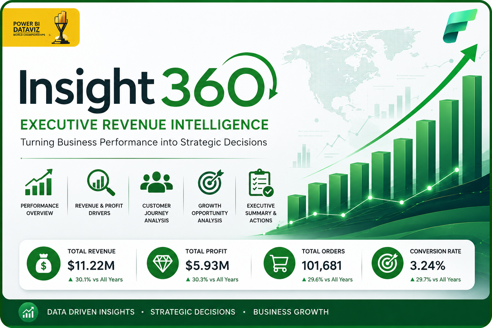
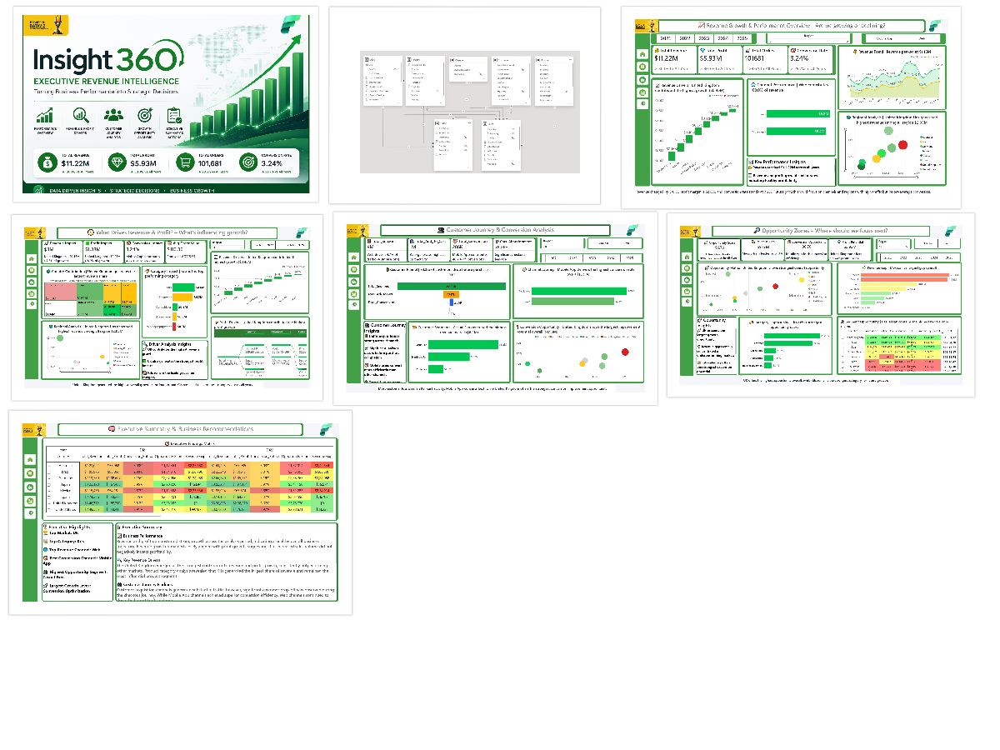
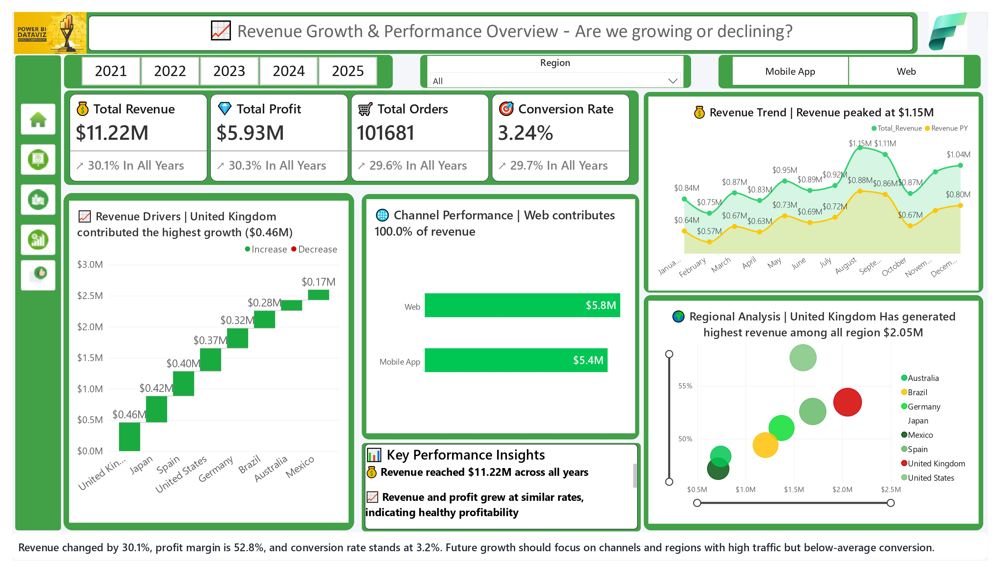
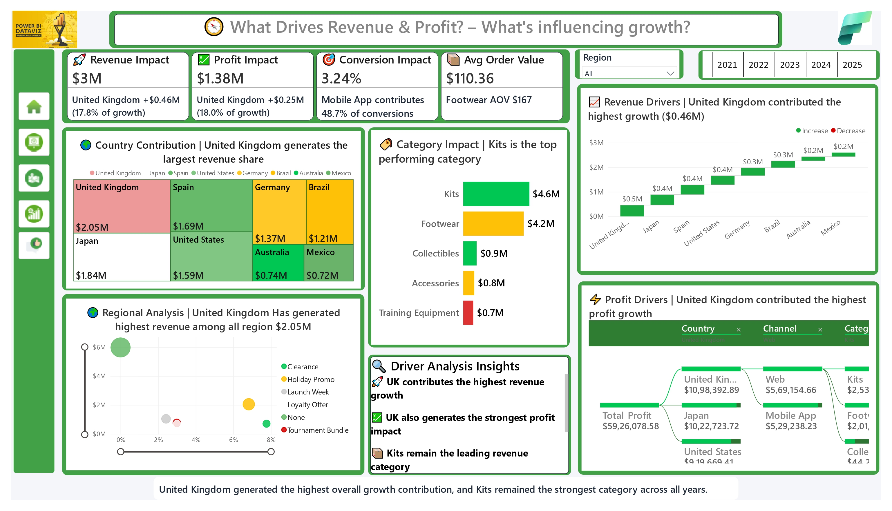
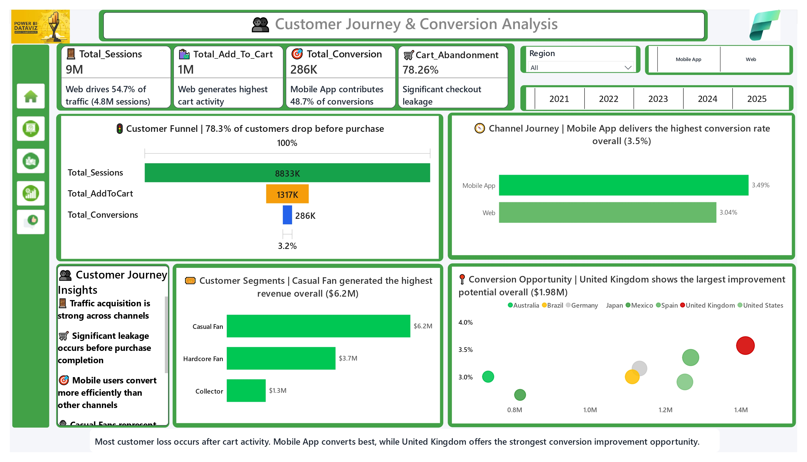
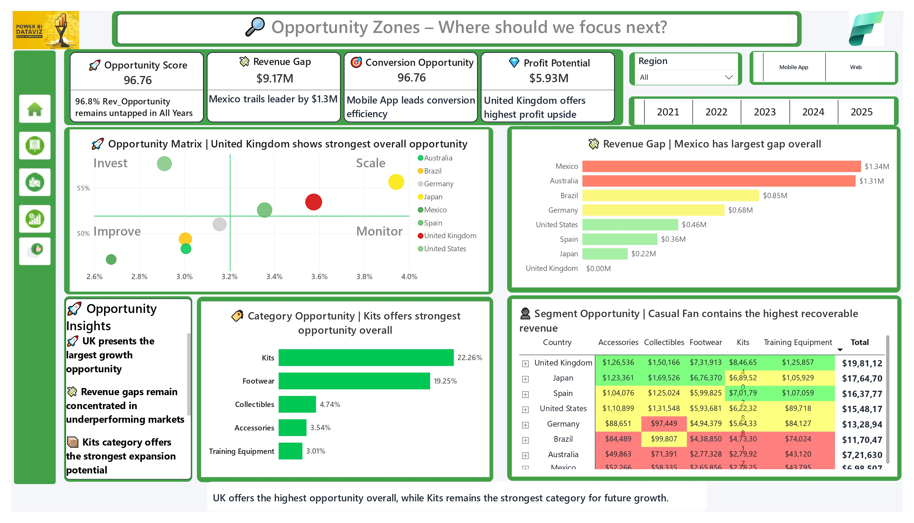
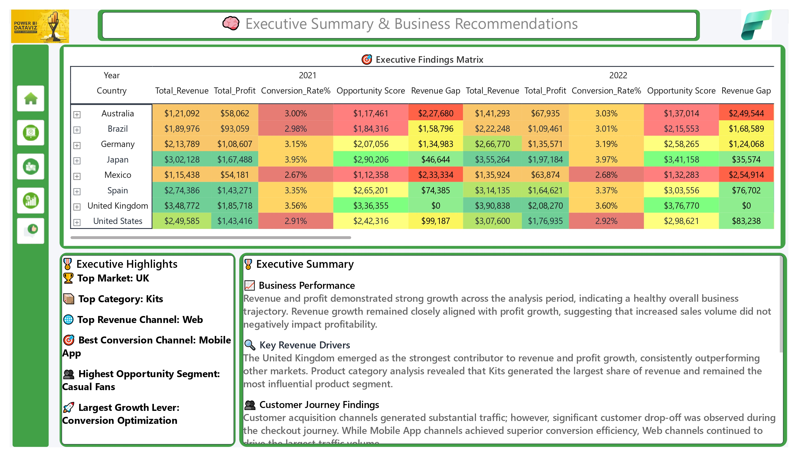
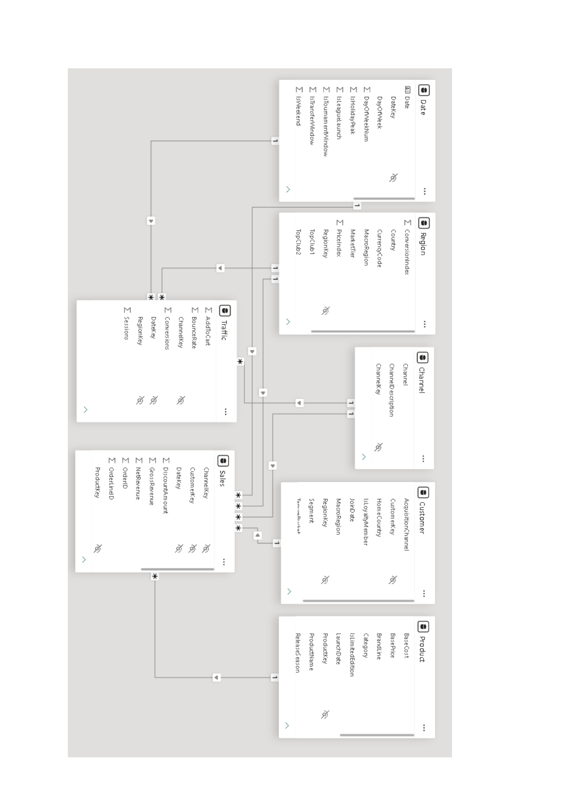

# 📊 Insight360 – Executive Revenue Intelligence Dashboard

> Turning Business Performance into Strategic Decisions with Microsoft Power BI

---

<p align="center">
  
</p>

---

## Overview

**Insight360** is an executive-level Power BI dashboard built to transform raw business data into actionable strategic insights.

The solution enables decision makers to monitor revenue performance, identify growth drivers, analyze customer conversion behaviour, uncover future opportunities, and support executive decision making through a clean, interactive reporting experience.

This repository showcases the dashboard design, analytical thinking, data modelling approach, DAX implementation, and reporting workflow.

> **Note**
>
> This repository is intended as a portfolio demonstration of my work.
> It is **not an official competition submission repository** and does not redistribute any datasets or materials that violate competition rules or licensing terms.

---

# Dashboard Preview

<p align="center">

</p>

---

# Business Problem

Business leaders often receive dozens of disconnected reports covering revenue, customers, products, marketing, and operations.

This makes it difficult to answer strategic questions such as:

- Are we actually growing?
- Which countries drive revenue?
- Which products create profit?
- Which customer segments convert best?
- Where should we invest next?
- Which opportunities remain untapped?

Insight360 answers these questions through one integrated executive dashboard.

---

# Dashboard Pages

---

## 1️⃣ Executive Revenue Overview

<p align="center">

</p>

### Purpose

Provides executives with an instant snapshot of overall business performance.

### Highlights

- Revenue KPI
- Profit KPI
- Orders
- Conversion Rate
- Revenue Trend
- Regional Performance
- Revenue Drivers
- Channel Performance
- Executive Insights

---

## 2️⃣ Revenue & Profit Driver Analysis

<p align="center">

</p>

### Focus

Understand **what drives revenue and profitability**.

### Includes

- Country Contribution
- Category Performance
- Revenue Waterfall
- Profit Drivers
- Driver Analysis
- Decomposition Tree
- Growth Insights

---

## 3️⃣ Customer Journey & Conversion Analysis

<p align="center">

</p>

### Focus

Analyze customer behaviour throughout the purchasing journey.

### Includes

- Customer Funnel
- Conversion Rate
- Cart Abandonment
- Channel Comparison
- Customer Segments
- Conversion Opportunity
- Customer Journey Insights

---

## 4️⃣ Opportunity Analysis

<p align="center">

</p>

### Focus

Identify the highest business growth opportunities.

### Includes

- Opportunity Matrix
- Revenue Gap
- Opportunity Score
- Category Opportunity
- Segment Opportunity
- Future Growth Areas

---

## 5️⃣ Executive Summary

<p align="center">

</p>

### Focus

Deliver executive recommendations supported by business metrics.

### Includes

- Executive Findings Matrix
- Strategic Recommendations
- Business Summary
- Executive Highlights
- Opportunity Summary

---

# Data Model

<p align="center">

</p>

The report follows a **star-schema model** designed for scalable reporting.

### Fact Tables

- Sales
- Traffic

### Dimension Tables

- Date
- Product
- Customer
- Region
- Channel

This structure improves:

- Query performance
- Maintainability
- DAX efficiency
- Filter propagation

---

# Features

- Executive KPI Cards
- Dynamic Titles
- Custom Tooltips
- Bookmarks
- Drillthrough
- Cross Filtering
- Field Parameters
- Conditional Formatting
- Smart Narrative
- Decomposition Tree
- Waterfall Analysis
- Funnel Analysis
- Scatter Analysis
- Matrix Heatmaps
- Responsive Navigation

---

# Technical Skills Demonstrated

### Power BI

- Data Modeling
- Report Design
- Interactive Dashboards
- Performance Optimization

### DAX

- Time Intelligence
- KPI Measures
- Variance Analysis
- Dynamic Titles
- Ranking
- Context Transition
- Business Logic
- Opportunity Scoring

### Data Visualization

- Executive Reporting
- Storytelling
- KPI Design
- Information Hierarchy
- UX Principles

---

# Key Business Insights

Some of the major insights generated include:

- United Kingdom contributed the highest revenue growth.
- Kits remained the strongest performing product category.
- Mobile App achieved the highest conversion efficiency.
- Significant revenue opportunities remain in underperforming regions.
- Customer drop-off occurs primarily before purchase completion.
- Revenue and profit grew consistently throughout the analysis period.

---

# Tools Used

- Microsoft Power BI Desktop
- Power Query
- DAX
- Data Modeling
- Microsoft Fabric Design Principles

---

# Repository Structure

```
Insight360/

│
├── README.md
├── images/
│   ├── Thumbnail.png
│   ├── gallery.png
│   ├── cover_page.jpg
│   ├── Drivers.jpg
│   ├── Journeys.jpg
│   ├── Opportunities.jpg
│   ├── Executive.jpg
│   └── Model_view.jpg
│
└── (PBIX file intentionally omitted)
```

---

# About the PBIX File

The Power BI report file is **not included in this public repository**.

This repository focuses on demonstrating dashboard design, analytical methodology, and reporting capabilities while respecting applicable competition requirements and licensing considerations.

---

# Author

**Rohan Singh Rawat**

Data Analyst | Business Intelligence | Power BI Developer

- LinkedIn
- GitHub

---

# Disclaimer

This repository is intended solely for educational and portfolio purposes.

Any trademarks, logos, or brand names appearing in dashboard screenshots remain the property of their respective owners.

This project is an original analytical work created by the repository author. It is not affiliated with or endorsed by Microsoft.
